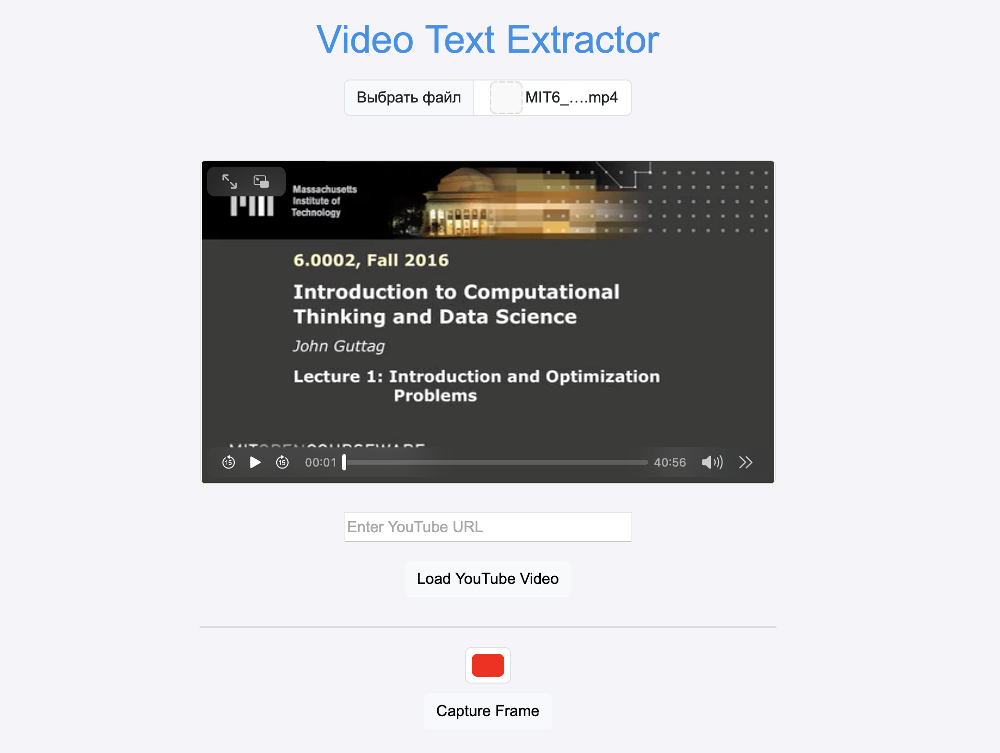
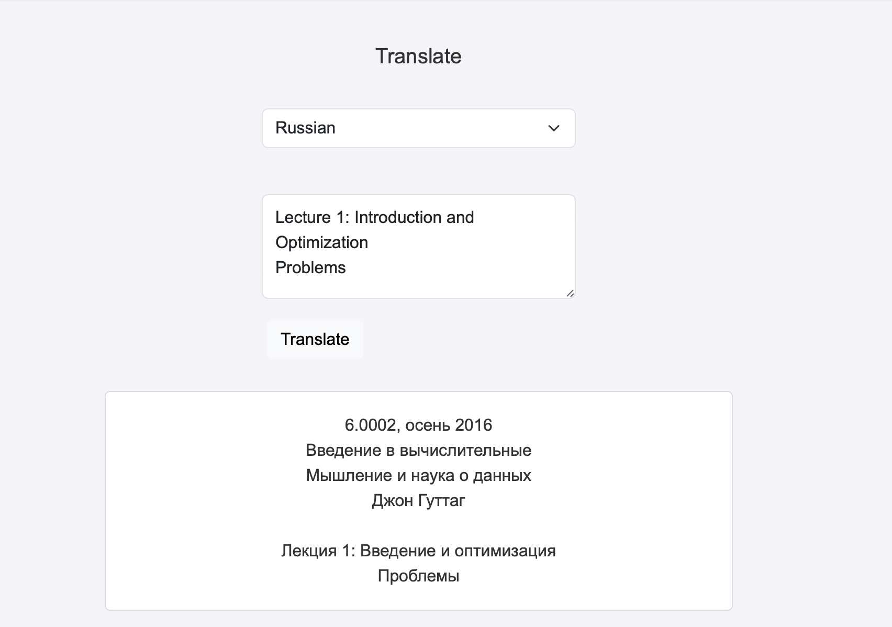

# Video Text Extractor

## Описание проекта
Этот проект представляет собой web-приложение, которое позволяет пользователям загружать видео, выбирать область на видео для захвата кадра, извлекать текст из захваченного кадра и при необходимости переводить этот текст на другой язык.






## Основные функции
1. Загрузка видео:

- Пользователь может загрузить видеофайл с локального устройства.
- Загруженное видео воспроизводится в видеоплеере на веб-странице.

2. Захват кадра:

- Пользователь может выделить прямоугольную область на захваченном кадре, чтобы указать, какую часть изображения использовать для распознавания текста.

3. Распознавание текста:

- Выделенная область отправляется на сервер для обработки.
- Сервер выполняет распознавание текста (OCR) и возвращает извлеченный текст обратно на клиентскую сторону.
- Извлеченный текст отображается на веб-странице.

4. Перевод текста:

- Пользователь может ввести текст для перевода и выбрать целевой язык.
- Введенный текст отправляется на сервер, где происходит перевод.
- Переведенный текст возвращается и отображается на веб-странице.
- Есть возможность дополнить количество доступных языков для перевода в файле `index.html`:
    ```
        <select id="languageSelect">
            <option value="en">English</option>
            <option value="ru">Russian</option>
            <!-- Add more language options as needed -->
        </select>
    ```
